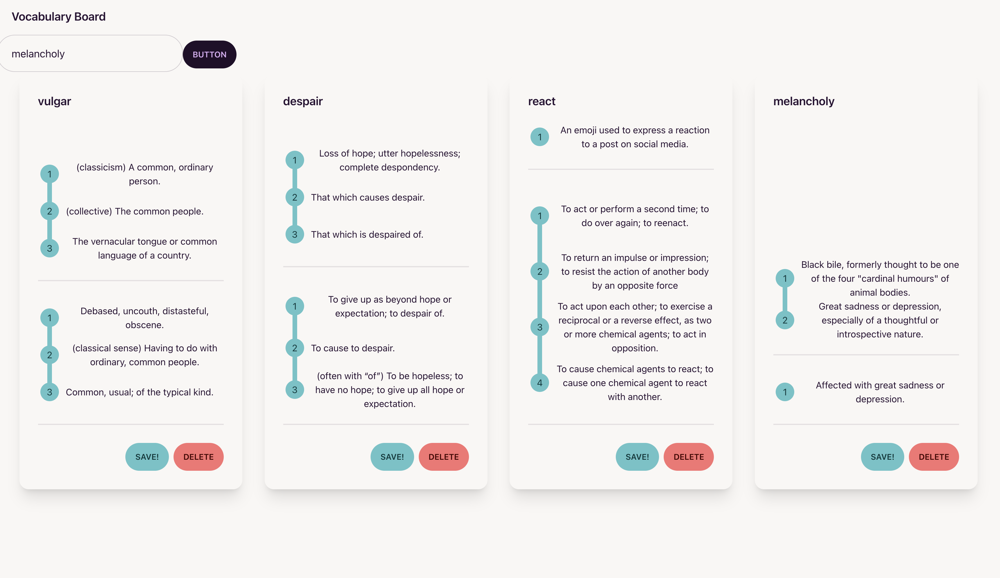

# Vocabulary board

A small app to bookmark some words I'm trying to remember.

# For the future

- Better style.
- More responsive card and flex box container.
- Add tags to these cards for easy groupping.
  - Add a different way to visualise the board.
- Add a search bar that searches the defeintions and the words.
- Switch to IndexDB.
